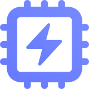

&nbsp;

<p align="center">
  <a href="https://py.n6.ai" target="_blank" rel="noopener noreferrer">
    
  </a>
</p>

# n6py

[](https://pypi.org/project/n6py)
[](https://pypi.org/project/n6py)

> Python Power Tools for Scientific Computing, Machine Learning and Deep Learning.

## Installation

### Cloud

**Colab**

```sh
!pip install n6py --no-deps
```

### Local

**pip**

```sh
pip install n6py
```

**Poetry**

```sh
poerty add n6py
```

## Usage

To use the `n6py` package, import it into your project.

```py
import n6py as n6
```

## Development

### Cloud

Get started on a remote machine.

[](https://github.com/codespaces/new?hide_repo_select=true&ref=main&repo=568493639)

### Local

Get started on a local machine.

<details>
<summary>Steps</summary>

#### Prerequisites

- [Python v3+](https://www.python.org/downloads/)
- [Poetry](https://python-poetry.org/)

Set the following environment variables for Poetry:

```sh
poetry config virtualenvs.in-project true
```

#### Installing

Install all dependencies and create a `venv` with Poetry. Additionaly add pre-commit hooks.

```sh
poetry install
poetry run pre-commit install
```

</details>

### Use venv

> The `venv` is automatically activated in `VS Code` when opening a new terminal window. You don't need to run the poetry shell command manually, simply open a new terminal after the dependencies are installed.

```sh
poetry shell
```
